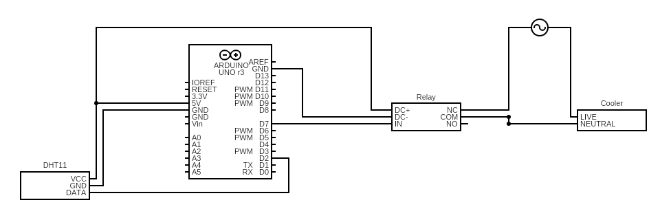

# Arduino controlled meat curing chamber

## About the project
This is a project made to monitor and control a fridge or cooler to a suitable temperature and humidity. I will usse this more specfically to cure charcuterie. Both whole muscles such as coppa, duck breast and pancetta but also sausages like salami.

Currently I am only monitoring and controlling temperature. And monitoring humidity, I have to adjust the humidity manually at this point.

### Built with
- [Arduino UNO R3](https://www.sparkfun.com/products/11021) as microcontroller
- [DHT11](https://www.adafruit.com/product/386) as temperature and humidity sensor
- [5v relay](https://www.banggood.com/1CH-Channel-Relay-Module-5V-For-250VAC60VDC-10A-Equipment-Device-p-1628746.html?rmmds=search&cur_warehouse=CN) to control cooler
- Mini fridge as cooler and chamber

#### Arduino libraries
- [DHT Sensor Library](https://github.com/adafruit/DHT-sensor-library)
- [Adafruit Unified Sensor Lib](https://github.com/adafruit/Adafruit_Sensor)

#### Current wiring

### Roadmap
- Change DHT11 sensor for [DHT22](https://www.adafruit.com/product/385). DHT22 offers more precision

- Implement humidity control. Missing dehumidifier and humidifier to do this. Might also need a bigger chamber first.

- Adding WiFi shield for wireless communication with the device. [ESP8266](https://www.sparkfun.com/products/17146)

- Add load cells to monitor the weight of the meat during the drying process. To easier determine when it is done.

- Use the monitor data from the Arduino to make a visual tracking sysem for the cured meat. Easier keep track of the process, and determine the optimal temperature and humidity for best possible outcome.
